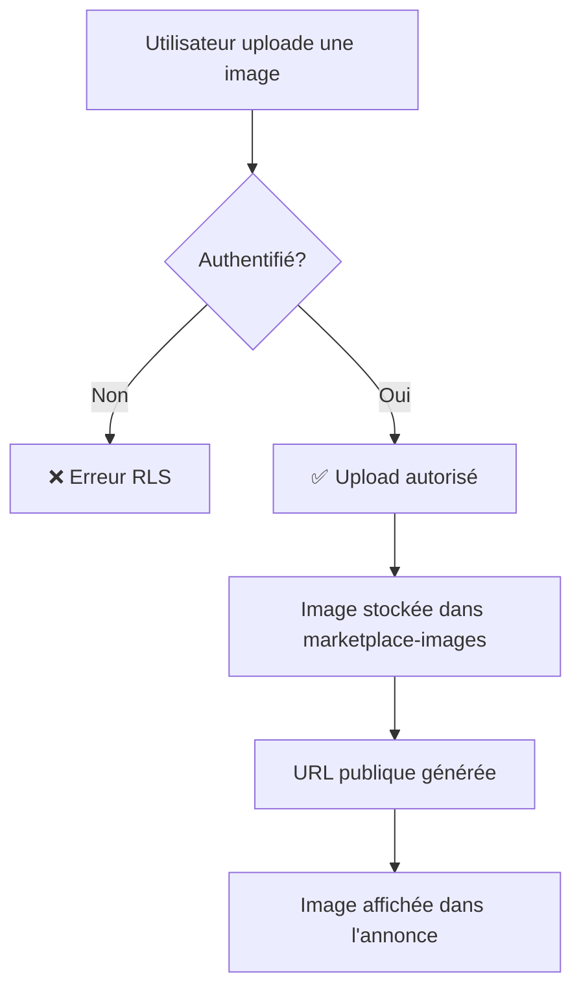

# 🚨 SOLUTION - Erreur Upload Images Marketplace

## ❌ Le Problème

Vous rencontrez l'erreur suivante lors de l'upload d'images :

```
StorageApiError: new row violates row-level security policy
```

**Cause** : Les politiques de sécurité RLS (Row-Level Security) du bucket Storage `marketplace-images` ne sont pas configurées.

---

## ✅ La Solution (3 minutes)

### Étape 1 : Exécuter la migration SQL

1. **Accédez au dashboard Supabase** : https://supabase.com/dashboard
2. **Sélectionnez** votre projet **Gemou2**
3. **Menu** → **SQL Editor**
4. **New Query**
5. **Copiez-collez** le contenu ENTIER du fichier :
   ```
   supabase/migrations/20251021120000_setup_marketplace_images_storage.sql
   ```
6. **Exécutez** (bouton Run ou `Ctrl+Enter`)

### Résultat Attendu

Vous devriez voir dans les logs :

```sql
===========================================
✅ Configuration du Storage Marketplace
===========================================
Bucket créé: true
Politiques RLS configurées: 4

🎉 SUCCESS! Le storage marketplace est prêt.

📋 Configuration:
  - Bucket: marketplace-images
  - Public: Oui (lecture seule)
  - Taille max: 10MB
  - Formats: JPEG, PNG, GIF, WebP
  - Upload: Utilisateurs authentifiés uniquement
===========================================
```

---

### Étape 2 : Vérifier dans l'interface Supabase

1. **Menu** → **Storage**
2. Vous devriez voir le bucket **`marketplace-images`**
3. **Cliquez dessus** → **Policies** (onglet)
4. Vous devriez voir **4 politiques** :
   - ✅ Authenticated users can upload marketplace images
   - ✅ Anyone can view marketplace images  
   - ✅ Users can update own marketplace images
   - ✅ Users can delete own marketplace images

---

### Étape 3 : Tester l'upload

1. **Ouvrez votre application** : `/create-trade`
2. **Remplissez le formulaire** :
   - Type : Vente
   - Titre : "Test Upload"
   - Jeu : (sélectionnez un jeu)
   - État : "Bon état"
   - Prix : 10
3. **Uploadez une image** :
   - Glissez-déposez une image dans la zone d'upload
   - OU cliquez pour sélectionner un fichier
4. **Attendez** que l'upload se termine
5. **Vérifiez** que l'image s'affiche dans la prévisualisation
6. **Publiez l'annonce**

### Résultat Attendu

- ✅ L'image s'upload sans erreur
- ✅ La prévisualisation s'affiche
- ✅ L'annonce est créée avec l'image
- ✅ Pas d'erreur dans la console

---

## 🔍 Dépannage

### L'erreur persiste après la migration

**Vérifiez que la migration a bien été exécutée :**

```sql
-- Exécutez dans SQL Editor
SELECT id, name, public 
FROM storage.buckets 
WHERE id = 'marketplace-images';
```

**Résultat attendu :**
```
id                    | name                | public
----------------------|---------------------|--------
marketplace-images    | marketplace-images  | true
```

Si vide, réexécutez la migration.

---

### Vérifier les politiques RLS

```sql
-- Exécutez dans SQL Editor
SELECT policyname, cmd 
FROM pg_policies 
WHERE schemaname = 'storage' 
  AND tablename = 'objects'
  AND policyname LIKE '%marketplace images%';
```

**Résultat attendu : 4 lignes**

---

### Erreur "Bucket already exists"

Si vous voyez cette erreur, c'est que le bucket existe déjà. Dans ce cas :

1. **Menu** → **Storage** → **marketplace-images**
2. **Settings** (onglet)
3. Vérifiez que **Public** est à `true`
4. **Policies** (onglet)
5. Si les 4 politiques ne sont pas présentes, exécutez manuellement :

```sql
-- Politique 1: Upload
CREATE POLICY "Authenticated users can upload marketplace images" 
ON storage.objects
FOR INSERT 
WITH CHECK (
  bucket_id = 'marketplace-images' 
  AND auth.role() = 'authenticated'
);

-- Politique 2: Lecture
CREATE POLICY "Anyone can view marketplace images" 
ON storage.objects
FOR SELECT 
USING (bucket_id = 'marketplace-images');

-- Politique 3: Mise à jour
CREATE POLICY "Users can update own marketplace images" 
ON storage.objects
FOR UPDATE 
USING (
  bucket_id = 'marketplace-images' 
  AND auth.uid()::text = (storage.foldername(name))[1]
);

-- Politique 4: Suppression
CREATE POLICY "Users can delete own marketplace images" 
ON storage.objects
FOR DELETE 
USING (
  bucket_id = 'marketplace-images' 
  AND auth.uid()::text = (storage.foldername(name))[1]
);
```

---

## 📋 Ce Que Cette Migration Fait

### 1. Création du Bucket

- **Nom** : `marketplace-images`
- **Visibilité** : Public (lecture seule)
- **Limite** : 10MB par fichier
- **Formats** : JPEG, JPG, PNG, GIF, WebP

### 2. Politiques RLS Configurées

#### INSERT (Upload)
- ✅ Uniquement les utilisateurs **authentifiés**
- ❌ Les utilisateurs anonymes ne peuvent PAS uploader

#### SELECT (Lecture)
- ✅ **Tout le monde** peut voir les images
- Même les utilisateurs non connectés

#### UPDATE (Modification)
- ✅ Uniquement le **propriétaire** de l'image
- Utilise `auth.uid()` pour vérifier la propriété

#### DELETE (Suppression)
- ✅ Uniquement le **propriétaire** de l'image
- Utilise `auth.uid()` pour vérifier la propriété

---

## 🎯 Flux de Données



---

## 🔐 Sécurité

### Ce qui est protégé

- ✅ Seuls les utilisateurs connectés peuvent uploader
- ✅ Limite de taille : 10MB
- ✅ Formats d'images vérifiés
- ✅ Chaque utilisateur ne peut supprimer que ses propres images

### Ce qui est public

- ✅ Les images uploadées sont **publiques en lecture**
- ✅ Pas besoin d'authentification pour voir les images
- ✅ Permet l'affichage dans les annonces pour tous

---

## 📝 Checklist

- [ ] ✅ Migration `20251021120000_setup_marketplace_images_storage.sql` exécutée
- [ ] ✅ Bucket `marketplace-images` visible dans Storage
- [ ] ✅ 4 politiques RLS configurées
- [ ] ✅ Bucket configuré en `public: true`
- [ ] ✅ Test d'upload réussi depuis `/create-trade`
- [ ] ✅ Image visible dans la prévisualisation
- [ ] ✅ Annonce créée avec succès

---

## 💡 Pourquoi Cette Erreur ?

Par défaut, **Supabase active RLS sur toutes les tables et buckets**. Cela signifie que **TOUTES** les opérations sont bloquées jusqu'à ce que vous définissiez explicitement des politiques.

C'est une **bonne pratique de sécurité** qui évite les fuites de données, mais cela nécessite de configurer les politiques manuellement.

---

## 📚 Pour Aller Plus Loin

### Documentation Supabase Storage

- [Storage Buckets](https://supabase.com/docs/guides/storage)
- [RLS Policies](https://supabase.com/docs/guides/auth/row-level-security)
- [Storage Security](https://supabase.com/docs/guides/storage/security/access-control)

### Fichiers Liés

- Migration : `supabase/migrations/20251021120000_setup_marketplace_images_storage.sql`
- Composant Upload : `apps/web/components/marketplace/ImageUpload.tsx`
- Page de création : `apps/web/app/create-trade/page.tsx`

---

**Temps total estimé** : 3 minutes ⏱️

✅ **Une fois cette migration exécutée, l'upload d'images fonctionnera !**


