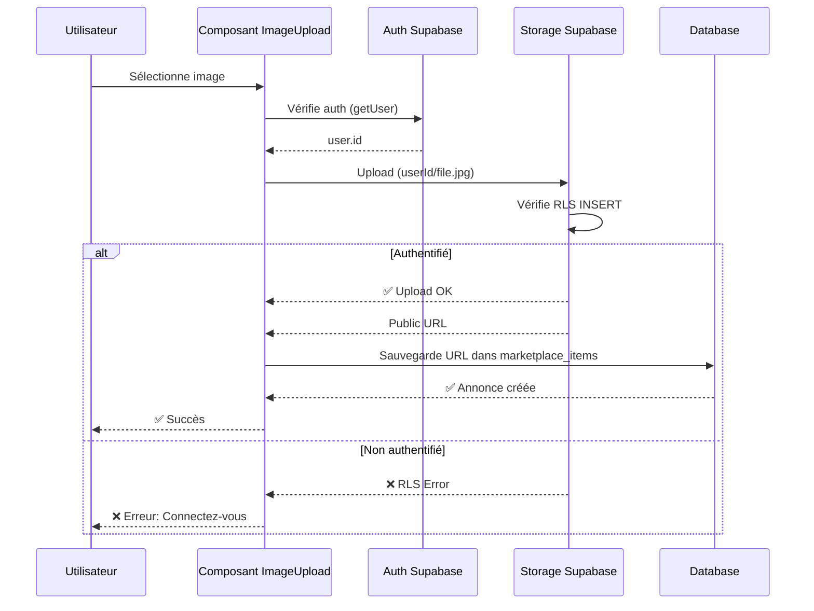

# 📋 RÉCAPITULATIF - Corrections Upload Images

## 🎯 Problème Résolu

**Erreur initiale** :
```
StorageApiError: new row violates row-level security policy
```

**Cause** : Politiques RLS manquantes sur le bucket Storage `marketplace-images`

---

## ✅ Corrections Appliquées

### 1. Migration SQL Créée

**Fichier** : `supabase/migrations/20251021120000_setup_marketplace_images_storage.sql`

**Contenu** :
- ✅ Création du bucket `marketplace-images`
- ✅ Configuration en mode public (lecture seule)
- ✅ Limite de taille : 10MB
- ✅ Formats autorisés : JPEG, PNG, GIF, WebP
- ✅ 4 politiques RLS configurées :
  - INSERT : Utilisateurs authentifiés uniquement
  - SELECT : Public (tout le monde)
  - UPDATE : Propriétaire uniquement
  - DELETE : Propriétaire uniquement

### 2. Composant ImageUpload Amélioré

**Fichier** : `apps/web/components/marketplace/ImageUpload.tsx`

**Changements** :
- ✅ Organisation des fichiers par utilisateur (`userId/filename.ext`)
- ✅ Vérification de l'authentification avant upload
- ✅ Messages d'erreur améliorés
- ✅ Meilleure gestion des erreurs

**Avantages** :
- 🔐 Sécurité renforcée (chaque utilisateur a son dossier)
- 🗂️ Organisation claire des fichiers
- 🔍 Traçabilité : facile d'identifier le propriétaire
- ♻️ Suppression facilitée (les politiques RLS fonctionnent correctement)

---

## 📝 Fichiers de Documentation Créés

| Fichier | Description |
|---------|-------------|
| `FIX_STORAGE_RLS.md` | Guide détaillé complet (dépannage, explications) |
| `QUICK_FIX_UPLOAD.md` | Guide rapide 2 minutes |
| `RECAP_CORRECTIONS_STORAGE.md` | Ce fichier (récapitulatif) |

---

## 🚀 Comment Appliquer le Fix

### Option 1 : Migration Complète (Recommandé)

```bash
# Dans Supabase SQL Editor
# Copiez-collez le contenu de :
supabase/migrations/20251021120000_setup_marketplace_images_storage.sql
```

### Option 2 : Script Rapide

Voir `QUICK_FIX_UPLOAD.md`

---

## 🔍 Structure du Storage

### Avant la Correction

```
marketplace-images/
  (vide ou erreur RLS)
```

### Après la Correction

```
marketplace-images/
  ├── {user_id_1}/
  │   ├── 1729500000_abc123.jpg
  │   ├── 1729500100_def456.png
  │   └── ...
  ├── {user_id_2}/
  │   ├── 1729510000_ghi789.jpg
  │   └── ...
  └── ...
```

**Avantages** :
- Chaque utilisateur a son propre dossier
- Facile de retrouver les images d'un utilisateur
- Les politiques RLS utilisent le nom du dossier pour vérifier la propriété

---

## 🔐 Politiques RLS en Détail

### 1. INSERT (Upload)

```sql
CREATE POLICY "Authenticated users can upload marketplace images" 
ON storage.objects
FOR INSERT 
WITH CHECK (
  bucket_id = 'marketplace-images' 
  AND auth.role() = 'authenticated'
);
```

**Signification** :
- ✅ Seuls les utilisateurs **connectés** peuvent uploader
- ❌ Les anonymes sont bloqués

### 2. SELECT (Lecture/Téléchargement)

```sql
CREATE POLICY "Anyone can view marketplace images" 
ON storage.objects
FOR SELECT 
USING (bucket_id = 'marketplace-images');
```

**Signification** :
- ✅ **Tout le monde** peut voir les images
- Même sans connexion
- Nécessaire pour afficher les annonces publiques

### 3. UPDATE (Modification)

```sql
CREATE POLICY "Users can update own marketplace images" 
ON storage.objects
FOR UPDATE 
USING (
  bucket_id = 'marketplace-images' 
  AND auth.uid()::text = (storage.foldername(name))[1]
);
```

**Signification** :
- ✅ Vous pouvez modifier **uniquement vos propres images**
- ❌ Impossible de modifier les images des autres
- Utilise le nom du dossier (`user_id`) pour vérifier

### 4. DELETE (Suppression)

```sql
CREATE POLICY "Users can delete own marketplace images" 
ON storage.objects
FOR DELETE 
USING (
  bucket_id = 'marketplace-images' 
  AND auth.uid()::text = (storage.foldername(name))[1]
);
```

**Signification** :
- ✅ Vous pouvez supprimer **uniquement vos propres images**
- ❌ Impossible de supprimer les images des autres

---

## 🧪 Plan de Test

### 1. Test de Base

```bash
# 1. Exécutez la migration SQL
# 2. Ouvrez /create-trade
# 3. Remplissez le formulaire
# 4. Uploadez une image
# 5. Vérifiez la prévisualisation
# 6. Publiez l'annonce
```

**Résultat attendu** :
- ✅ Pas d'erreur dans la console
- ✅ Image uploadée et visible
- ✅ Annonce créée avec succès

### 2. Test de Sécurité

```bash
# 1. Créez une annonce avec image (utilisateur A)
# 2. Notez l'URL de l'image
# 3. Déconnectez-vous
# 4. Vérifiez que l'image est toujours visible (public)
# 5. Reconnectez-vous avec utilisateur B
# 6. Tentez de supprimer l'image de A (devrait échouer)
```

**Résultat attendu** :
- ✅ Images visibles en mode public
- ✅ Impossible de supprimer les images d'autrui

### 3. Test d'Organisation

```bash
# Dans Supabase Dashboard → Storage → marketplace-images
# Vérifiez la structure :
```

```
marketplace-images/
  └── {votre_user_id}/
      └── {timestamp}_{random}.{ext}
```

**Résultat attendu** :
- ✅ Fichiers organisés par dossier utilisateur
- ✅ Noms de fichiers uniques

---

## 🎯 Flux de Données Complet



---

## 📊 Comparaison Avant/Après

| Aspect | Avant | Après |
|--------|-------|-------|
| **Upload** | ❌ Erreur RLS | ✅ Fonctionne |
| **Organisation** | ⚠️ Fichiers en vrac | ✅ Par utilisateur |
| **Sécurité** | ❌ Pas de protection | ✅ RLS complet |
| **Suppression** | ⚠️ Non sécurisée | ✅ Propriétaire uniquement |
| **Visibilité** | ⚠️ Non configurée | ✅ Public en lecture |
| **Limite taille** | ⚠️ Non définie | ✅ 10MB |
| **Formats** | ⚠️ Tous acceptés | ✅ Images uniquement |

---

## 🔧 Dépannage

### Erreur : "User not authenticated"

**Cause** : L'utilisateur n'est pas connecté

**Solution** :
```typescript
// Vérifiez que l'utilisateur est bien connecté
const { data: { user } } = await supabase.auth.getUser();
console.log('User:', user);
```

### Erreur : "Bucket already exists"

**Cause** : Le bucket a déjà été créé

**Solution** : Normal ! La migration utilise `ON CONFLICT DO NOTHING`

### Images non visibles après upload

**Cause** : URL incorrecte ou bucket non public

**Solution** :
```sql
-- Vérifiez que le bucket est public
SELECT id, public FROM storage.buckets WHERE id = 'marketplace-images';
-- Résultat attendu : public = true
```

### Impossible de supprimer ses propres images

**Cause** : Format du path incorrect

**Solution** :
```typescript
// Le path doit être : userId/filename.ext
// Vérifiez dans le code :
const fileName = `${user.id}/${Date.now()}_${random}.${ext}`;
```

---

## 📚 Ressources

### Documentation Supabase

- [Storage Buckets](https://supabase.com/docs/guides/storage)
- [RLS Policies](https://supabase.com/docs/guides/auth/row-level-security)
- [Storage Security](https://supabase.com/docs/guides/storage/security/access-control)

### Fichiers du Projet

| Type | Fichier |
|------|---------|
| Migration | `supabase/migrations/20251021120000_setup_marketplace_images_storage.sql` |
| Composant | `apps/web/components/marketplace/ImageUpload.tsx` |
| Page | `apps/web/app/create-trade/page.tsx` |
| Doc | `FIX_STORAGE_RLS.md` |
| Quick Fix | `QUICK_FIX_UPLOAD.md` |

---

## ✅ Checklist Finale

### Configuration Supabase

- [ ] Migration SQL exécutée
- [ ] Bucket `marketplace-images` créé
- [ ] Bucket configuré en public
- [ ] 4 politiques RLS actives
- [ ] Limite de taille : 10MB
- [ ] Formats d'images configurés

### Code

- [ ] Composant ImageUpload mis à jour
- [ ] Upload organisé par utilisateur (`userId/file`)
- [ ] Vérification auth avant upload
- [ ] Gestion d'erreurs améliorée

### Tests

- [ ] Upload d'image fonctionnel
- [ ] Prévisualisation affichée
- [ ] Annonce créée avec succès
- [ ] Images visibles en public
- [ ] Suppression limitée au propriétaire

---

## 🎉 Résultat Final

**Avant** :
- ❌ Upload impossible (erreur RLS)
- ❌ Pas de sécurité
- ❌ Fichiers désorganisés

**Après** :
- ✅ Upload fonctionnel
- ✅ Sécurité RLS complète
- ✅ Organisation par utilisateur
- ✅ Politiques claires et maintenables
- ✅ Documentation complète

---

**L'upload d'images pour le marketplace est maintenant pleinement fonctionnel et sécurisé ! 🚀**


